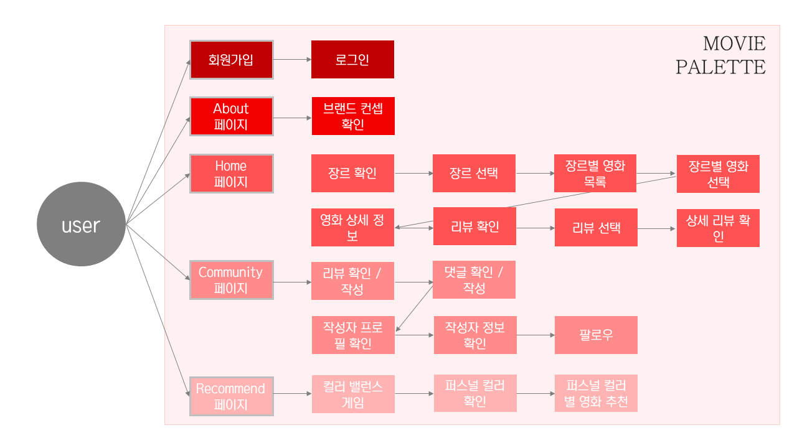
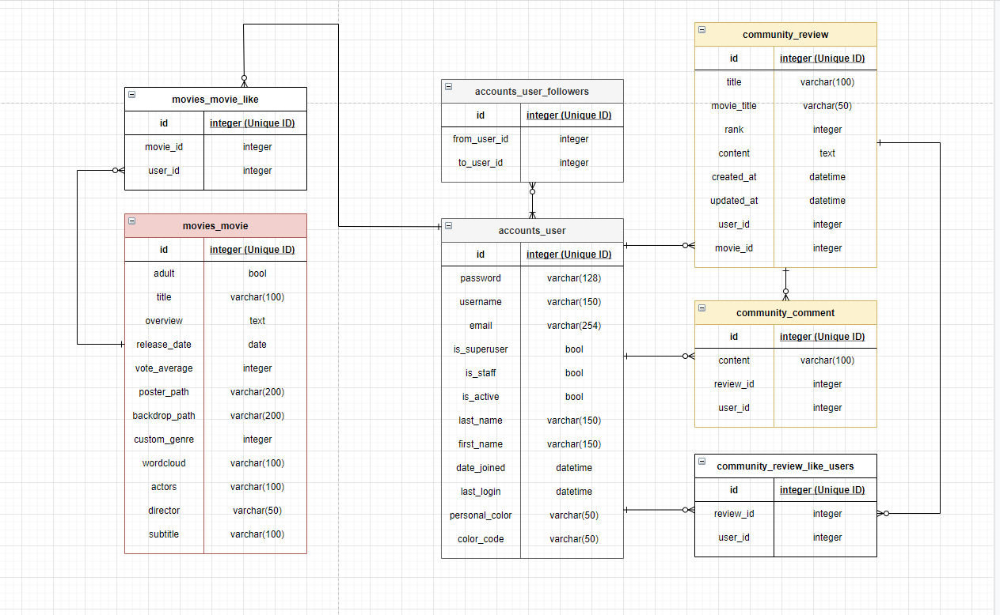
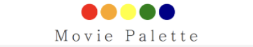
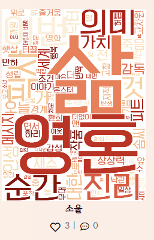
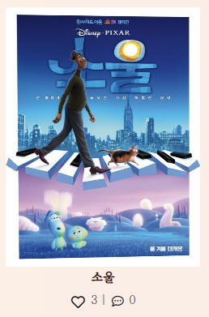
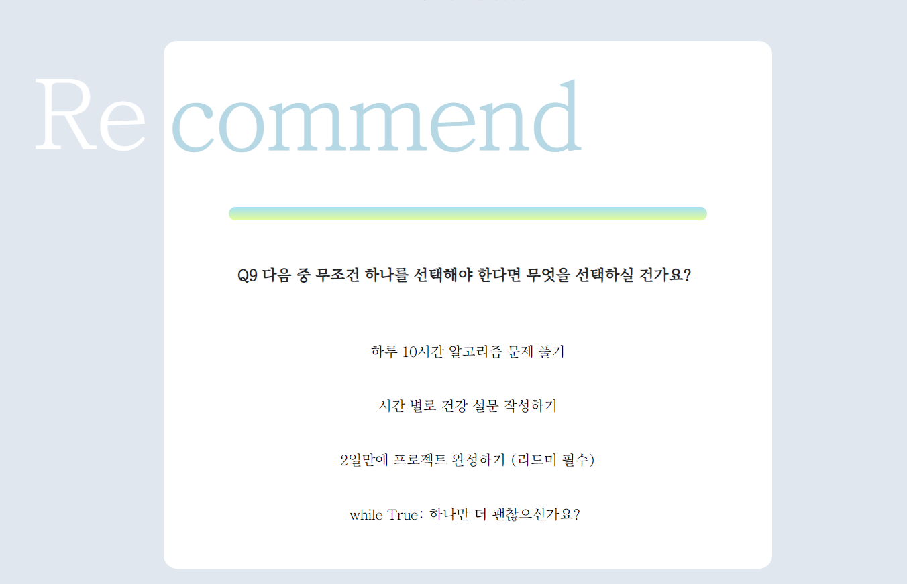
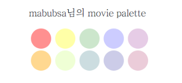
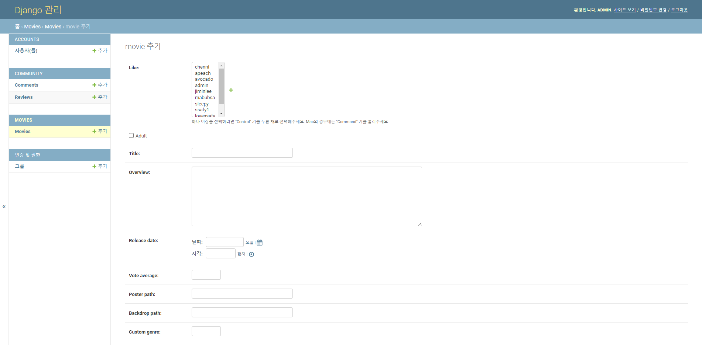
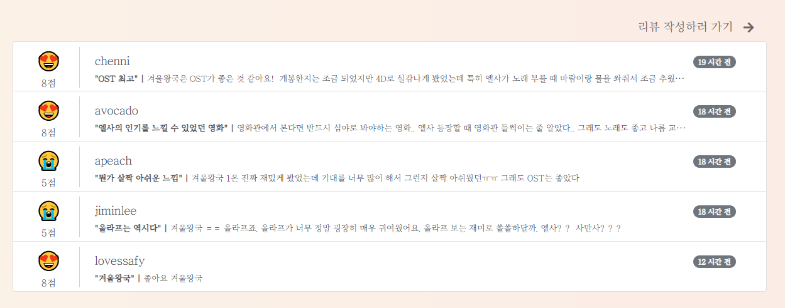
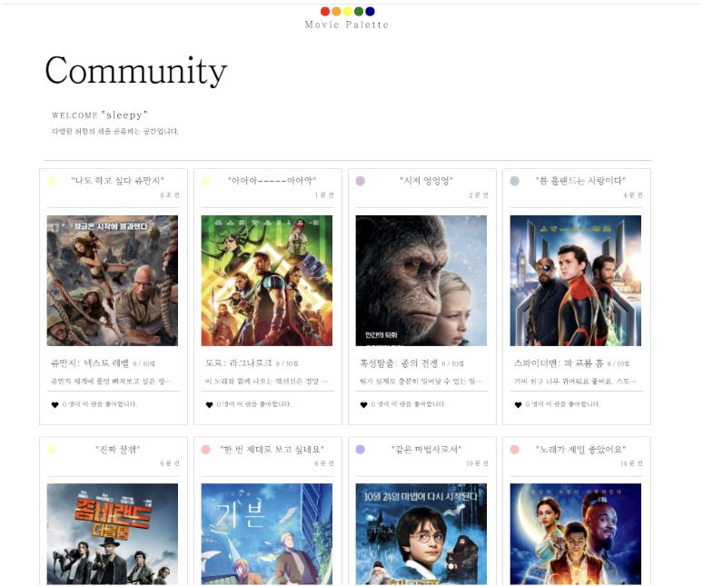

# Final Project

2021.05.27

<Br>

<br>

## 프로젝트 개요

| NO   | INDEX                                   | NOTE                              |
| ---- | --------------------------------------- | --------------------------------- |
| 0    | [기초 틀 잡아가기](#기초-틀-잡아가기)   | 프로젝트의 기반 사항              |
| 1    | [프로젝트 설명](#프로젝트-설명)         | 프로젝트의 주요 기능 및 핵심 코드 |
| 2    | [명세 요구사항](#명세-요구사항)         | 명세서의 요구사항                 |
| 3    | [프로젝트 돌아보기](#프로젝트-돌아보기) | 기타 및  마무리                   |

<br>

<Br>

## 개발환경

언어: Python 3.8+, Django 3.X

도구: vsCode, Chrome Browser

아키텍처: `Django & Vanilla JS `

#### 팀 구성

김채은(팀장) _ Front template

이지민(팀원) _ Data/ View

Django + Vanilla JS의 아키텍쳐를 가져가는 만큼, 경계가 뚜렷하지 않아 협업 작업이 多

<br>

<Br>

## 기초 틀 잡아가기

유스케이스와 ERD 작성을 통해 초기 모델링 진행 > 이후 모델 수정 작업은 많았으나, 초기 틀이 견고했기에 큰 문제는 없었다 

#### 모델





<br>

<Br>

## 프로젝트 설명

'' 영화는 색깔이다" 라는 문장에서 시작되는 프로젝트

영화는 각자의 빛깔을 가지고 있고, 이는 마치 팔레트에 담긴 물감과 비슷하다고 생각했다.

`영화 취향을 칠하는 당신만의 Movie Palette`라는 컨셉을 가지고 본 프로젝트를 진행한다.


#### 주요 기능

##### 1. NAV BAR




컨셉에 맞추어 네비게이션 바를 팔레트 모양으로 만들었다. 각 동그라미를 누르면 연결된 url로 이동하게 된다. 연결 페이지는 기능들을 얼추 다 구현 한 후에 사용자 경험을 고려하여, 적절한 위치에 매칭했다. 로그인을 한 유저의 경우와, 하지 않은 경우를 나누어 생각

로그인 O 유저:   로그아웃   About   MyPage   Recommend   Community

로그인  X 유저:   회원가입   About   Login       Recommend   Community

마지막으로 Movie Palette는 Home 으로 이동할 수 있게 만들었다

추가 사항/ 네비게이션 바에 대한 설명은 About 페이지에 기재되어있지만, 이것만으로는 부족하다고 판단. 사용자 경험을 더 높이기 위해서 해당 영역에 마우스 커서를 올렸을 때, title 속성을 이용해서 어떤 곳으로 이동하는 url인지 가시적으로 확인할 수 있게끔 설정해놨다

<br>

<br>

##### 2. Wordcloud

 

데이터 크롤링을 활용해 네이버 영화 리뷰 페이지에서 리뷰를 추출한다. 이를 우리 사이트에서 설정한 장르 색에 맞춰 워드 클라우드로 변환시키는 작업을 거친 후, 영화 목록 페이지에서 사용자가 영화 포스터에 마우스 커서를 올리면 확인할 수 있도록 설계

해당 작업은 굉장한 오류들과 마주했던 파트이기도 하다.  어떠한 문제를 마주하고 해결했는 지 간략하게 아래에서 설명해본다

```python
# 리뷰가 존재하지 않으면 워드클라우드가 작동을 안한다?
- 해결: `if len(data) == 0: continue`

        
# 다음으로 넘어가질 않는다..?
- 원인: 워드클라우드가 닫히지 않아서? 해당 과정이 끝나지 않아서 생기는 문제 
- 해결 https://theonly1.tistory.com/2470 참고

  ```python
      plt.show(block=False)
      plt.pause(0.3)
      plt.close()
```

# NoSuchElementException?
- 원인: 해당 영화를 검색하고 다음 페이지로 넘어갔을 때, 영화가 존재하지 않아서 관련 태그(btn_srch, result_thumb)가 존재하지 않아 생기는 문제
- 해결 : try - except 문

  ```python
      try:
          driver.find_element_by_class_name('btn_srch').click()
      except NoSuchElementException:
          continue
      try:
          driver.find_element_by_class_name('result_thumb').click()
      except NoSuchElementException:
          continue
  ```

- 처음에는 try - finally를 사용했는데 `finally: driver.quit()`  MaxRetryError 발생
- driver.quit()를 계속 시행하면 브라우저가 연결을 거부한다?? 이런 이유인 것 같다!

```

 위와 같은 과정들을 거치며 크롤링이란 기능을 사용할 때에는 `예외 처리`에 대해 많은 고민을 해야겠다는 생각이 들었다. 우리가 생각하기에 아 이정도는 어때 라는 부분들이 크롤링 시에는 죄다 걸림돌이 되기에. 알고리즘 문제를 풀 때처럼, 숨겨진 테스트케이스를 찾는다는 생각으로 크롤링을 다뤄가야 할 것 같다.

<br>

우리가 저장한 영화 객체들을 가져와 제목을 검색으로 넘겨 크롤링을 진행시키려 했는데, 마주한 또다른 에러 상황

​```python
# ImportError?

- 원인: Django에 기본으로 설정된 파일 이름이 아닌 다른 이름의 파일을 만들었기에, Django가 해당 파일을 읽어오지 못해 발생하는 오류였다. 같은 파일 트리 내에 있다고 같이 관리되는 게 아님. 기존 장고 프로젝트 따로, 우리가 만든 파일 따로.
- 해결: 환경 변수 설정을 통해서 Django에게 해당 파일을 인식시켜주어야 한다
    
import os, django
os.environ.setdefault('DJANGO_SETTINGS_MODULE', '프로젝트이름.settings')
django.setup()
from 앱이름.models import 모델이름

```

 <br>

<Br>

##### 3. Recommend



사용자에게 9개의 질문을 제공한 후, 사용자의 응답에 따라 나온 결과값으로 `나만의 색` 추천 및 해당 색과 어울리는 `영화 추천 서비스`

<bR>

#### 알고리즘 로직

1. `나만의 색 추천`

   유저의 성향을 추측할 수 있는 질문들을 던진다.

   해당 질문에 대한 응답은 4개. 각 응답에는 우리의 커스텀 장르들이 매칭되어있다. 

   (1: 1 매칭은 아니다. 문제에 따라 어떤 응답에는 두 개의 커스텀 장르가 매칭되어있기도)

   유저가 응답을 선택하면, 해당 응답에 대응되는 장르들의 value 값이 올라가고(default 0으로 설정)

   유저가 모든 응답을 마치면, value 값이 제일 높은 두 장르를 계산해서 구한다

   두 장르의 조합에 매칭되는 나만의 색을 데이터 lookup table에서 가져와 html에 보인다 (유저에게 제공)

2. `색에 어울리는 영화 추천`

   유저가 추천받기 버튼을 누르면, 앞서서 구해진 장르 2개를 params에 담아 DB에 axios GET 요청을 보낸다.

   views.py에서 Django ORM filter 를 사용해 두 장르에 속하는 영화들 중, 평점이 가장 높은 순으로 5편을 뽑아 응답한다.

   응답받은 데이터를 js를 사용해서 html에 나타낸다

3. `추가사항`

   추천 받은 나만의 색을 저장한 후,  프로필 페이지에서 나만의 색을 확인할 수 있다. 색이 마음에 들지 않거나, 다른 색이 궁금하다면, 해당 테스트를 다시 진행할 수도 있다. 단, 로그인 하지 않은 사용자의 경우, 저장 및 영화 추천과 같은 추가 기능은 제공되지 않는다.

```javascript
//recommend/static/start,js << 핵심 코드는 여기에서

// 해당 부분에서 나를 정말 후.... 험한 말 나오게 했던 에러
// 나는 분명 axios POST로 요청을 보냈는데 왜 때문에 로그에는 계속 GET 요청이 갔다는 거지?? 심지어 url도 이상... 대환장


// 해결 코드 
const btn1 = document.querySelector('#loadpost')
const csrftoken = document.querySelector('[name=csrfmiddlewaretoken]').value

const data = new FormData()

  btn1.addEventListener('click', function (event) {
    let point = calculation()
    const name = infoList[point].name
    const code = colorMatch[point].color  
    data.append('personal_color', name)
    data.append('color_code', code)


    axios({
      method: 'post',
      url: 'http://127.0.0.1:8000/recommend/load/',
      headers: {
        'X-CSRFToken': csrftoken,
      },
      data,
    })
    .then(function (response) {
      const p = document.querySelector('#responseMessage')
      p.innerHTML = response.data.content
    })
    .catch(function (error) {
      console.log(error)
    })
})

```

원인은 아마 버블링 때문일 것이라고 교수님께서 알려주셨다. 여러 메서드들이 체이닝되어 사용되는 와중에, 어떤 부분이 엉켜서 그러한 에러가 나는 것일 거라고! 그래서 폼 대신 여기선 버튼을 이용. 대신 버튼을 이용한다면 기존의 폼처럼 데이터가 담겨서 넘어가질 못하므로 FormData()를 생성한 후, 이를 기존의 데이터처럼 생각해서 사용하면 된다.

<br>

<Br>

##### 4. Movie Palette

    Profile 페이지에 들어가면 확인할 수 있는 나만의 영화 팔레트

- DB에 axios를 사용해 사용자가 좋아요한 영화에 대한 정보 요청
- 응답받은 정보를 기반으로 팔레트의 투명도 계산 진행 (장르별 비율에 따라 달라지는 투명도)
- 사용자의 영화 취향에 따른 팔레트 생성

<br>

해당 부분에서 가장 고민했던 부분은 어떻게 사용자임을  axios에 담아 넘겨줄 것인가였다. 사용자가 누구인지를 알려줘야, 그 사람이 좋아요한 영화를 알 수 있고, 해당 정보를 응답받아 가져올 텐데. 아니 도대체 어떻게

정글 속에 빠져버린 나를 구원해준 건 바로 `console.log()`

모를 땐, 그냥 찍어보는 게 답인 것 같다. 콘솔로 윈도우 창이 뜰 때의 event를 살펴봤는데, 아니 타고타고 들어가다보니까 주소 경로를 통해서 사용자의 username을 가져올 수 있어보이잖아??!  라는 깨달음을 얻었다.

사랑해요 콘솔

```javascript
//창이 뜨면 다음의 함수를 바로 실행해라 

window.onload = function (event) {
    console.log(event)
    let path = event.target.location.pathname
    let username = path.substring(10, path.length-1)
    console.log(username)
    axios.get('http://127.0.0.1:8000/accounts/get_movies/', {
      params: {
        username,
      }
    })
    .then(function (res) {
      const movies = res.data
      const count = res.data.length

      if (movies.filter(function (movie) {
        return movie.custom_genre === 1
      }).length >= 1) {
        const redCount = movies.filter(function (movie) {
          return movie.custom_genre === 1
        }).length / count + 0.2
        console.log(redCount)
        const red = document.querySelector('#red')
        red.style.opacity = 0.1 + redCount
      }
```

<br>

<Br>

## 명세 요구사항

<BR>

#### A. 관리자 뷰

장고에서 기본적으로 제공해주는 ADMIN 페이지 활용. LIST_DISPLAY 속성을 통해 표를 볼 때 조금 사람 친화적으로 보이게끔 수정




<BR>

#### B. 영화 정보

#### DB

- DB 영화 데이터 총 205개

- 데이터 처리 방식 

`TMDB API`를 이용해서  해당 URL로 데이터 요청을 보낸다

```python
# 요청 보내고자 하는 url을 만드는 함수

API_URL = 'https://api.themoviedb.org/3'
API_KEY = config('TMDB_API_KEY')


def get_url(category='movie', feature='', **kwargs):
    url = f'{API_URL}/{category}/{feature}'
    url += f'?api_key={API_KEY}'

    for k, v in kwargs.items():
        url += f'&{k}={v}'
    return url
```

[discover/movie/?api_key={{ API_KEY }}&language=ko&with_genres=18](https://developers.themoviedb.org/3/discover/movie-discover)  

한국어로 된 자료들 & 장르 코드가 18인 영화를 discover 해라

프로젝트 컨셉에 따라 위처럼 `장르 코드를 기반으로` 영화 데이터를 받아오기로 결정

장르 코드는 [POSTMAN요청](https://api.themoviedb.org/3/genre/movie/list?api_key=a4f4fe301a6ed6249fc06484ad844067)을 통해 미리 숙지

이후, 각 장르 코드마다 100개씩의 데이터를 가져오는 함수 실행(중복되는 데이터는 받아오지 않기에 실제 DB에 저장되는 데이터는 요청을 보내는 데이터 수와 차이가 있다)

주의사항// 프로젝트 전반적으로 우리가 지정한 `커스텀 장르는 매우 중요하다` 따라서 모델 작성 시, 해당 필드를 꼭 만들고, 데이터를 받아올 때 장르에 맞게 해당 필드를 채워주어야 한다  

```python
# movies/views.py 

def get_movie_data(request, custom_genre):
    ...
    
def load_movie_data():
    for key, value in genre_lookup.items():
        for genre_code in value:
            get_movie_data(genre_code, key)
```

위의 TMDB API만을 사용하면, 감독과 배우 정보에 대해서는 알 수 없다. 그래서  `Naver API `를 추가적으로 사용.

Naver API는 요청 시 기본적으로 검색어가 필수로 들어가야 함. 그래서 TMDB API를 통해 들어온 영화 데이터들의 title을 검색어로 활용. 요청을 날린 후,  받은 데이터들을 기존 DB에 추가적으로 넣는 작업 필요

고로, 모델에 Naver API에서 받아 올 필드들을 미리 구성해놓아야 한다 - subtitle, director, actors 필드 추가

API를 요청하는 방식은 TMDB와 상이. 해당 부분은  [공식문서 참조](https://developers.naver.com/docs/search/movie/)

```python
# movies/views.py

def add_info():
    ...
```

<br>

#### 로그인 된 유저/ 평점

- 영화에 대한 평점을 유저가 리뷰 안에서 처리할 수 있도록 구성 (리뷰 작성 시, 평점 등록이 같이 이루어짐)

- 영화 상세 페이지에서 해당 영화에 대한 평점을 등록 (리뷰 작성 바로가기를 통해)
- 영화에 대한 리뷰 상세 페이지에서 유저는 평점을 수정하거나 삭제할 수 있다



<br>

<Br>

#### C. 추천 알고리즘은 핵심 기능에서 언급

<br>

<Br>

#### D. 커뮤니티

##### Community Index

커뮤니티 index 페이지에서 전체 리뷰 목록을 카드 형식으로 보여준다

좋아요를 누를 수 있고, 해당 리뷰에 대한 간략한 내용을  확인할 수 있다 (생성 시각 정보 포함)

해당 영화의 커스텀 장르 색이 라벨링 되어있다 / 해당 기능을 통해 커뮤니티 페이지에서도 장르 구분이 가능하다/ 이후 기능적으로 확장해나갈 수 있는 지점이라 생각(장르별로 리뷰를 묶어서 보일 수도 있어진다)

    

<Br>

##### Community Detail

로그인 한 사용자와 하지 않은 사용자 간의 구분을 둔다. 

1. 로그인 한 사용자만이 해당 페이지에 접근할 수 있다. 이는, 인덱스 페이지도 마찬가지. 
2. 로그인 한 사용자만이 글을 생성할 수 있다. 해당 처리는 Movie Detail 페이지에서도 확인 가능(해당 페이지에서 Community Detail로 오는 이동이 존재, 로그인 한 사용자만이 이동 가능)

<br>

작성자 본인과 로그인 한 사용자 간의 구분을 둔다

1. 작성자 본인만이 글을 Update, Delete 할 수 있도록 views.py에서의 처리뿐 아니라 html에서도 작성자에게만 해당 버튼이 보이게끔
2. 작성자 본인만이 본인의 댓글을 삭제할 수 있도록 마찬가지로 views.py의 처리 + html 적인 처리 실행

<Br>

<br>

#### E. 기타

##### URL

프로젝트 urls.py 에서 처음 화면을 열자마자 에러 페이지가 아닌 movies/ 로 이동할 수 있게끔 하는 작업 시행

```python
# moviepalette

from django.contrib import admin
from django.urls import path, include
from django.conf import settings
from django.conf.urls.static import static
from movies import views

urlpatterns = [
    path('admin/', admin.site.urls),
    path('movies/', include('movies.urls')),
    path('accounts/', include('accounts.urls')),
    path('community/', include('community.urls')),
    path('recommend/', include('recommend.urls')),
    path('', views.home)
] + static(settings.MEDIA_URL, document_root=settings.MEDIA_ROOT)
```

##### HTTP Method / 상태코드

메서드 부분은 상황에 맞게 사용하고, 달아주었지만, 상태코드 부분은 많이 고려하지 못한 부분인 것 같아 아쉬운 생각이 든다.

##### Ajax 비동기요청

리뷰, 영화 좋아요와  유저 간 팔로우 기능. 추천 서비스 기능에서도 비동기 요청 사용(한 페이지 내에서 이루어지는 서비스)

이외에도 페이지가 로드될 때마다 보내는 axios 요청 > 프로필 페이지의 사용자 팔레트, 좋아요 한 영화들에 대한 정보, 영화 상세 페이지에서 Youtube API 사용해 영화 트레일러 받아오기

<br>

<Br>

## 프로젝트 돌아보기

더 해보고 싶은 부분 & 프로젝트 중 든 잡다한 생각들

- 우리는 크롤링을 사전에 미리 작업해놓고, 해당 소스를 static으로 사용했는데 여기서 더 나아가 주기적으로 크롤링이 진행되어 워드클라우드가 갱신되게끔 한 번 해보고 싶다.
- API의 세계는 무궁무진한 것 같다. 처음에는 왜 이것밖에 나한테 정보를 안 주는 거야? 라며 되려 성냈지만. 파편화된 정보들을 여기저기서 모아 하나로 합쳐가는 과정도 (한 번 해보니) 재밌는 것 같다. 이 곳 저 곳의 데이터들을 합쳐서 요상하고도 기묘한 데이터를 만들어보고 싶다는 생각
- axios 요청이 생각보다 장고가 움직이는 내장 기본 원리? 방식과 연관이 깊다는 것을 느꼈다. 아니, 무슨 위치만 달라졌다고 파일을 못 읽는다고 하고 말이야. 알고 나니 허탈한 그런 느낌. 하지만 이런 걸 하나씩 알아갈수록 조금은 레벨 업하는 ... 하고 있지 ...?
-  아 youtube api 사용할 때, 많이 요청을 날리면 사용하지 못해요~ 라는 말을 흘려들었는데. 설마. 얼마나 날렸길래 막혀? 이러며 남 일로만 생각했는데 우리의 경우가 될 줄은... 확인이 필요한 경우를 제외하곤, 주석처리를 해놓는 게 편하겠다
- 바로 오늘. 교수님께 script 단에서는 config 로 API KEY를 어떻게 숨기죠?? 라는 질문을 드리고, 해결 방법도 들었는데 미처 적용해보지 못했다. 또륵. 교수님.. 하고 싶었는데... 제 머리와 손이 과부하가 왔나봐요... 됴르륵.. 나중에 .. 곧... 한 번 해봐야지
- CSS 멍청이로서 채은님... 채은님은 정말 짱이에요... 사랑... 당신은 CSS 천재 귀재 수재 영재 아보카도. 컴퓨터에 코딩으로 그림을 그리는 것만 같았어요... ⭐
- 아 맞아 그것도 해결하는데 시간이 꽤 걸렸는데. css js 파일들을 템플릿에 불러오는 과정. static을 이용해주면 되는데 약간 static은 그림이다라고 머리속에서 단정지어버려서, 해결하는 데 더 어려움을 겪었었다.
-  안되는 것도 엄청 많았고, 그 과정에서 배운 것도 엄청 많았는데 왜 때문에 지금 내 머리에는 아무 것도 없는 걸까
- 아 크롤링 관련 라이브러리 다운 받을 때, 순서가 중요했다? 의존성 어쩌구 때문에 그렇다구 하는 것 같은데, 처음에는 아무것도 모르고 내 마음대로 받다가 이래도 안돼고 저래도 안돼서 시작도 못하고 헤맸던 기억이 갑자기 스쳐 지나간다
- 그리고 이번 프로젝트를 하면서 git 으로 처음 같이 관리하며 진행했는데, 정말 정신을 차리구 해야겠다는 생각이 들었다. 아 이제는 익숙해졌지 하면 뭔가가 문제가 생겼고, 또 merge가 잘 돼도 문제가 생기는 경우가 더러 있었다. 상대방이 바꿔놓은 코드를 내 코드가 덮어쓰면서 없어졌다거나 이런 문제들. git은 항상 주의하며 관리해야겠다.
- 이번 프로젝트를 하면서 문제를 마주했을 때, 구글링 끝에 해결책으로 jQuery라는 친구를 참 많이 봤는데 한 번도 이를 가지고 문제를 해결하지는 못했다. 다음에 한 번 찬찬히 사용해봐야지
- 아 그리고 어제 두 개가 연결된 그런 로직을(movie_detail에서 리뷰 상세 들어가기/ community에서 리뷰 상세 들어가기) 아예 따로따로 분리해볼까 라는 생각이 들어서 해보려 했는데.... 처음에는 간단히 할 수 있지! 그냥 뷰 함수 하나 만들고 html 하나만 만들면 되는 거 아냐라고 생각했다가... 아. 이걸 고치려면. 저걸 고쳐야되고. 또 저걸 고치려면. 여기도 바뀌어야 되네. 와 저것도 ? 저기까지도 연결됐단 말이야? 모델부터 뜯어 고쳐야되네? 대박.... 이거 오늘 안에 안되겠는데 라는 결론에 다다랐고. 근데 한 번 해보고 싶긴 하다 (조건: 시간 많을 때)
- 프로젝트 초반에 장고를 오랜만에 하는데 기분이 묘했다. 장고의 노란 에러 지옥을 또다시 마주하니 뭔가 고향에 온 듯한 느낌이었달까. 아 그래 맞아. 장고는 이랬지. 반갑군
- 근데 문제는 이제 뷰가 기억 속에서 삭제됐다. 진짜 내 머리 속의 지우개.. 강력 지우개임이 틀림없다. 고작 며칠 안 봤다고 이렇게 다 까먹을 줄이야. 다른 팀은 뷰를 써서 프로젝트를 진행하시는 것 같았는데, 어떻게 하셨는지 정말 너무 궁금하다!! 
- 그것도 있다 맞아. 기능 구현을 어느 정도 다 마치고, 사용자가 된 기분으로 우리 사이트를 한 번 쭉 다 둘러봤는데 만들 때는 생각지 못한 부분들이 눈에 보였다. 페이지 이동 방식이라던지, 여기서 뭘 눌러야 되지 이런 부분들. 만들 때도, 나름 고려한다고 한 것 같은데 막상 만들다보면 거기에 매몰되어서 중립적으로 판단? 생각이 잘 안 되는 것 같다. 마치 내가 남인 것 마냥 리프레시하고 훑어보는 그런 시간들을 프로젝트 중간 중간 가지는 것도 좋을 것 같다.
- 리드미를 정말 오랜만에 완성해서 제출하는 것 같은데... :) 기분이 이상하다.  
- 엉엉 뭔가 리드미 쓰면서 교수님이라는 대나무 숲에 편하게 얘기하는 느낌이라 너무 좋았는데 ㅠㅠ 이제 이게 교수님과의 마지막 리드미라니ㅠㅠ 엉엉엉  아 아아!! 저 아직 완성 못한 리드미들...  막 45% 60% 이런 친구들과 함께 드문드문 불쑥불쑥 gitlab project repository로 나타날테니... 리드미로 다시 만나요 교수님 아디오스... > - <


1주일이 진짜.. 있는데 없어졌다. 내일이 금요일이라는 게 믿기지 않을 정도로. 

주어진 (짧은) 시간 내에 완성해야 하는 프로젝트였기에 심리적으로 부담도 많이 됐었지만, 그만큼 무언가 문제를 해결했을 때, 느끼는 기쁨과 보람이 평소와는 비교할 수 없이 컸던 것 같다. 

좋았다💜


