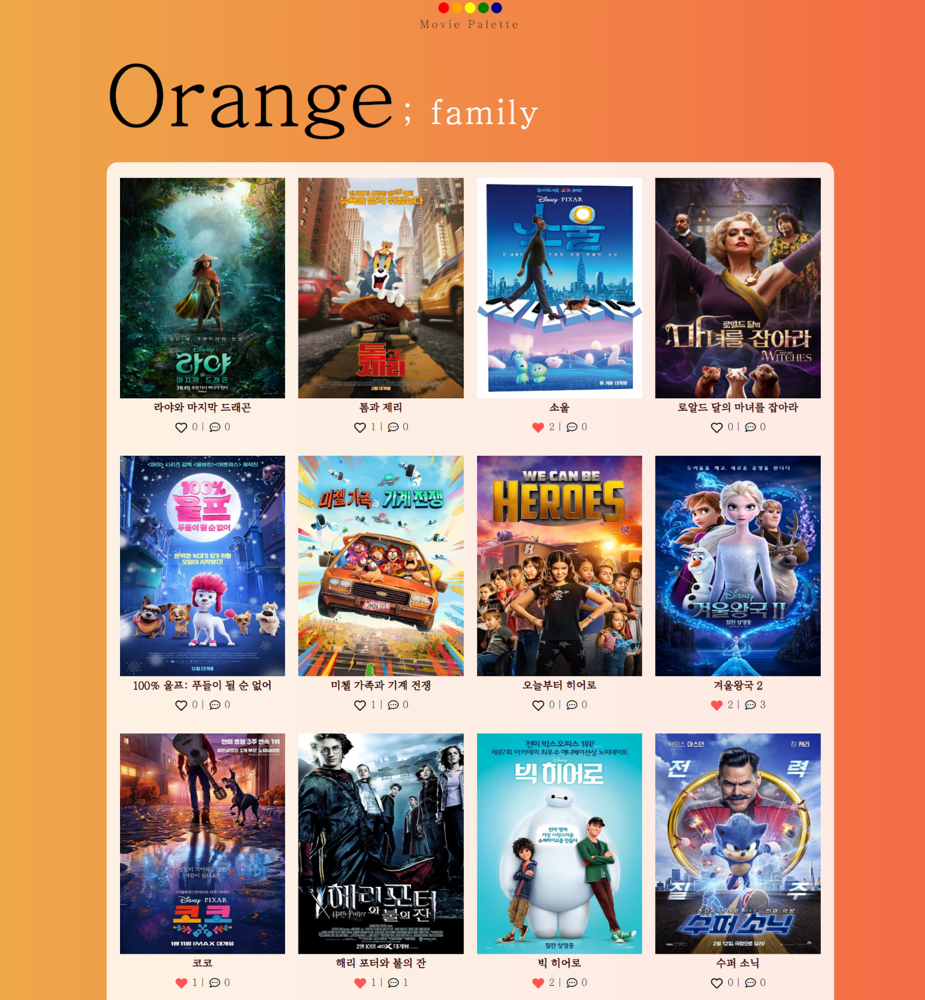

# Movie_Palette

2021.05.20 - 2021.05.27

> Django와 Vanilla JS를 활용한 영화 추천 및 커뮤니티 사이트

<br>

<br>

## Index

| NO   | INDEX                                   | NOTE                              |
| ---- | --------------------------------------- | --------------------------------- |
| 0    | [Preview](#Preview)                     | Movie Palette 사이트 미리보기     |
| 1    | [개발 환경 및 목표](#개발-환경-및-목표) | 프로젝트의 기반 사항              |
| 2    | [프로젝트 설명](#프로젝트-설명)         | 프로젝트의 주요 기능 및 핵심 코드 |
| 3    | [프로젝트 돌아보기](#프로젝트-돌아보기) | 프로젝트 달성도, 보완점 등 마무리 |

<br>

<br>

<br>

## Preview


<br>


<br>



<br>


<br>


<br>


<br>


<br>

<br>

<br>

## 개발 환경 및 목표

#### 1. 개발 스택

- 언어 :  Python 3.8+, Django 3.X

- 도구 :  vsCode, Chrome Browser

- 아키텍처 :  `Django & Vanilla JS `

<br>

#### 2. 설치

```bash
$ python -m venv venv
$ source venv/Scripts/activate
$ pip install -r requirements.txt
$ python manage.py migrate
$ python manage.py runserver
```

<br>

#### 3. 목표 설정

- 한 학기 동안 배운 내용을 최대한 적용하되, 중심이 잡힌 프로젝트를 만들자
- 네모난 바퀴도 괜찮으니 주어진 시간 안에 무조건 완성, 데굴데굴 굴러가자
- 협업 시에 각자 branch를 나누어 작업, Git을 적극적으로 활용하자

<br>

#### 4. 팀 구성

🥑 김채은(팀장) _ 템플릿 구현 등의 프론트엔드 담당

🧙‍♂️ 이지민(팀원) _ 데이터 베이스 구축 등의 벡엔드 담당

역할은 위와 같이 나누어졌지만, Django + Vanilla JS의 아키텍쳐를 사용하는 만큼 프론트와 백의 경계가 뚜렷하지 않아 많은 부분을 협업해서 작업

<br>

<br>

<br>

## 프로젝트 설명

#### 0. 개요

##### 영화 취향을 칠하는 당신만의 Movie Palette

''영화는 색깔이다" 라는 문장에서 시작되는 프로젝트

영화는 다양한 빛깔을 가지고, 이는 마치 팔레트에 담긴 물감과 비슷하다고 생각했다. 각기 다른 빛깔의 색이 팔레트에 담겨 하나의 색을(type) 가지는 것처럼. 사용자와 영화 사이에서 각기 다른 빛깔의 영화들을 모아 사용자만의 색을 찾아주는/영화 취향을 찾아주는 중간 매개체가 되고자 한다. 

<br>

##### 영화를 장르별로 특정 색깔과 매칭하여 분류하자

10 색상환을 기준으로 색상 이미지를 참고하여 영화 장르와 매칭. 해당 색과 장르를 매칭한 이유는 웹 사이트에 간단하게 명시. 영화 장르는 tmdb 사이트에서 제공하는 17개의 장르들을 비슷한 성격끼리 묶어 10개로 분류했다. 


<br>

#### 1. 모델링

##### Usecase

사용자의 관점에서 웹 사이트를 들어왔을 때 겪는 과정들, 또는 사용자가 경험할 수 있는 주요 기능 등에 대해서 논의를 하고 아래와 같은 유스케이스를 제작했다.


<br>

<br>

##### ERD

주모델 :  영화, 유저, 리뷰, 댓글 (1: N, M: N 관계로 이루어져있다)

주요 필드 :   영화 모델의 custom_genre 필드. 프로젝트 전반적으로 우리가 지정한 `커스텀 장르는 매우 중요하다` 따라서 모델 작성 시, 해당 필드를 꼭 만들고, 데이터를 받아올 때 장르에 맞게 해당 필드를 채워주어야 한다


<br>

<br>

#### 2. 주요 기능

##### NAV BAR

<br>


컨셉에 맞추어 네비게이션 바를 팔레트 모양으로 만들었다. 각 동그라미를 누르면 연결된 url로 이동하게 된다. 연결 페이지는 기능들을 얼추 구현한 후에 사용자 경험을 고려하여 매칭했다. 로그인을 한 유저의 경우, 하지 않은 경우를 나누어 생각. 로그인 여부에 따라 이동하는 url이 달라진다.

| 사용자 로그인 여부 |   🔴    |   🟠   |   🟡    |     🟢     |     🔵     |
| :----------------: | :----: | :---: | :----: | :-------: | :-------: |
|         O          | Logout | About | MyPage | Recommend | Community |
|         X          | Sigin  | About | Login  | Recommend | Community |

추가적으로 동그라미 하단에 있는 Movie Palette를 누르면 Home 페이지로 이동할 수 있게 구현했다. 네비게이션 바에 대한 설명은 About 페이지에 기재되어있지만, 이것만으로는 부족하다고 판단. 사용자 경험을 더 높이기 위해서 네비게이션 바의 각 영역에 마우스 커서를 올렸을 때, html의 title 속성을 이용해서 어떤 곳으로 이동하는 url인지 가시적으로 확인할 수 있게끔 설정해놨다.

<br>

<br>

##### Home Palette

홈 화면에서 원하는 색을 클릭하면 해당 색으로 컨테이너가 채워진다. 관련된 장르 내용이 보이고, 이외의 요소들은 보이지 않도록 구현. 컨테이너가 채워진 뒤 우측 상단에 x 버튼을 클릭하면, 앞서 설정한 값들이 반전되며 이전의 상태로 돌아가게 된다.  

  

아래는 movies/home.html script 부분에서 orange에 해당하는 코드

```javascript
// orangeSeen > orange 장르 내용, seen > 이외의 요소들
const app = new Vue({
        el: '#app', 
        data: {
          seen: true,
          orangeSeen: false,
        },
        methods: {
            ...
        }
      })
```

```javascript
//methods. 컨테이너를 채우는 메서드
largeColor: function (event) {
            const toggleBtn = document.querySelector('#toggleBtn')
            const navContent = document.querySelector('#navbarToggleExternalContent')
            if (navContent.classList.length === 4) {
              toggleBtn.click()
            }
            event.target.classList.add('large')
            setTimeout(() => this.seen = false, 1000);
            if (event.target.id === 'orange') {
              setTimeout(() => this.orangeSeen = true, 2000);
            }
            const chipColors = document.querySelectorAll('.color-chip')
            chipColors.classList.add('cursor-none')
          },
```

```javascript
//methods. 다시 원래의 화면으로 돌아가는 메서드
closeColor: function () {
            const orange = document.querySelector('#orange')
            if (orange.classList.contains('large')) {
              this.orangeSeen = false
              orange.classList.remove('large')
            }
            this.seen = true
            const chipColors = document.querySelectorAll('.color-chip')
            chipColors.classList.remove('cursor-none')
          }
```

<br>

<br>

##### Wordcloud

데이터 크롤링을 활용해 네이버 영화 리뷰 페이지에서 전문가/평론가 리뷰를 추출했다. 이를 사전에 설정한 장르 색에 맞춰 워드 클라우드로 변환했다. 영화 목록 페이지에서 유저가 영화 포스터에 마우스 커서를 올리면 워드 클라우드를 확인할 수 있도록 설계


<br>

해당 작업은 굉장한 오류들과 마주했던 파트이기도 하다.  어떠한 문제를 마주하고 해결했는 지 간략하게 아래에서 설명해본다.

###### /워드클라우드가 작동을 안한다?

- 원인:  크롤링한 데이터가 존재하지 않아서 워드 클라우드 생성 코드가 작동을 하지 않았던 거였다.
- 해결:  해당 데이터가 존재하지 않을 경우에 대한 if 문 처리

```python
if len(data) == 0: continue
```

###### /다음으로 넘어가질 않는다..?

- 원인:  워드클라우드가 닫히지 않아서, 해당 과정이 끝나지 않아서 생기는 문제 
- 해결:   https://theonly1.tistory.com/2470 참고

```python
plt.show(block=False)
plt.pause(0.3)
plt.close()
```

###### /NoSuchElementException?

- 원인:  해당 영화를 검색하고 다음 페이지로 넘어갔을 때, 영화가 존재하지 않아서 관련 태그(btn_srch, result_thumb)가 존재하지 않아 생기는 문제
- 해결:  try - except 문. 처음에는 try - finally를 사용했는데 `finally: driver.quit()`  MaxRetryError가 발생했다. driver.quit()를 계속 시행하면 브라우저가 연결을 거부하기에 finally 문은 사용할 수 없었다.

```python
try:
    driver.find_element_by_class_name('btn_srch').click()
except NoSuchElementException:
    continue
try:
    driver.find_element_by_class_name('result_thumb').click()
except NoSuchElementException:
    continue
```

<br>

위와 같은 과정들을 거치며 크롤링이란 기능을 사용할 때에는 `예외 처리`에 대해 많은 고민을 해야겠다는 생각이 들었다. 우리가 생각하기에 아 이정도는 괜찮지 라고 넘어갔던 부분들이 크롤링 시에는 죄다 걸림돌이 되기에. 알고리즘 문제를 풀 때처럼, 숨겨진 테스트케이스를 찾는다는 생각으로 크롤링을 다뤄야 할 것 같다.

<br>

사전에 저장된 영화 객체들을 가져와 영화 제목을 검색으로 넘겨 크롤링을 진행시키려 했는데, 마주한 또다른 에러 

###### /ImportError?

- 원인:  Django에 기본으로 설정된 파일 이름이 아닌 다른 이름의 파일을 만들었기에, Django가 해당 파일을 읽어오지 못해 발생하는 오류였다. 같은 파일 트리 내에 있다고 같이 관리되는 게 아님. 기존 장고 프로젝트 따로, 우리가 만든 파일 따로.
- 해결:  환경 변수 설정을 통해서 Django에게 해당 파일을 인식시켜주어야 한다

```python
import os, django
os.environ.setdefault('DJANGO_SETTINGS_MODULE', '프로젝트이름.settings')
django.setup()
from 앱이름.models import 모델이름
```

 <br>

<br>

##### Recommend

사용자에게 9개의 질문을 제공한 후, 사용자의 응답에 따라 나온 결과값으로 `나만의 색` 추천 및 해당 색과 어울리는 `영화를 추천해주는` 기능


<br>

##### 추천 알고리즘 로직 (recommend/static/start.js)

1) `나만의 색 추천`

유저의 성향을 추측할 수 있는 질문들을 던진다. 해당 질문에 대한 응답은 4개. 각 응답에는 커스텀 장르들이 매칭되어있다(1: 1 매칭은 아니다. 문제에 따라 어떤 응답에는 두 개의 커스텀 장르가 매칭되어있기도)

유저가 응답을 선택하면, 해당 응답에 대응되는 장르들의 value 값이 올라가고(default 0으로 설정) / 유저가 모든 응답을 마치면, value 값이 제일 높은 두 장르를 계산해서 구한다. 두 장르의 조합에 매칭되는 나만의 색을 데이터 lookup table에서 가져와 html에 보인다 (유저에게 제공)

2) `색에 어울리는 영화 추천`

유저가 추천받기 버튼을 누르면, 앞서서 구해진 장르 2개를 params에 담아 DB에 axios GET 요청을 보낸다. views.py에서 Django ORM filter 를 사용해 두 장르에 속하는 영화들 중, 평점이 가장 높은 순으로 5편을 뽑아 응답한다. 응답받은 데이터를 js를 사용해서 html에 나타낸다

3) `추가사항`

추천 받은 나만의 색을 저장한 후,  프로필 페이지에서 나만의 색을 확인할 수 있다. 색이 마음에 들지 않거나, 다른 색이 궁금하다면, 해당 테스트를 다시 진행할 수도 있다. 단, 로그인 하지 않은 사용자의 경우, 저장 및 영화 추천과 같은 추가 기능은 제공되지 않는다.

<br>

아래는 추천 로직을 짜며 가장 골머리를 앓았던 에러. 분명 axios POST로 요청을 보냈는데 로그에는 계속 GET 요청이 갔다고 나왔다. GET요청이 보내지는 url도 이상했다.

###### /버블링...?

- 원인:  여러 메서드들이 체이닝되어 사용되는 와중에, 어떤 부분이 엉켜서 위와 같은 에러가 나기도 한다.
- 해결:  폼 대신 여기선 버튼을 이용. 대신 버튼을 이용한다면 기존의 폼처럼 데이터가 담겨서 넘어가질 못하므로 FormData()를 생성한 후, 이를 기존의 데이터처럼 생각해서 사용하면 된다.

```javascript
// 해결 코드 
const btn1 = document.querySelector('#loadpost')
const csrftoken = document.querySelector('[name=csrfmiddlewaretoken]').value

const data = new FormData()

  btn1.addEventListener('click', function (event) {
    let point = calculation()
    const name = infoList[point].name
    const code = colorMatch[point].color  
    data.append('personal_color', name)
    data.append('color_code', code)


    axios({
      method: 'post',
      url: 'http://127.0.0.1:8000/recommend/load/',
      headers: {
        'X-CSRFToken': csrftoken,
      },
      data,
    })
    .then(function (response) {
      const p = document.querySelector('#responseMessage')
      p.innerHTML = response.data.content
    })
    .catch(function (error) {
      console.log(error)
    })
})

```

<br>

<br>

##### Movie Palette

 Profile 페이지에 들어가면 확인할 수 있는 나만의 영화 팔레트

   

- DB에 axios를 사용해 사용자가 좋아요한 영화에 대한 정보 요청
- 응답받은 정보를 기반으로 팔레트의 투명도 계산 진행 (장르별 비율에 따라 달라지는 투명도)
- 사용자의 영화 취향에 따른 팔레트 생성

<br>

해당 부분에서 가장 고민했던 부분은 어떻게 사용자임을  axios에 담아 넘겨줄 것인가였다. 사용자가 누구인지를 알려줘야, 그 사람이 좋아요한 영화를 알 수 있고, 해당 정보를 응답받아 가져올 수 있으므로.

정글 속에 빠져버린 나를 구원해준 건 바로 `console.log()`

모를 땐, 그냥 찍어보는 게 답인 것 같다. 콘솔로 윈도우 창이 뜰 때의 event를 살펴봤는데, 타고타고 들어가다보니까 주소 경로를 통해서 사용자의 username을 가져올 수 있었다. 유레카 사랑해요 콘솔

```javascript
//창이 뜨면 다음의 함수를 바로 실행해라 

window.onload = function (event) {
    console.log(event)
    let path = event.target.location.pathname
    let username = path.substring(10, path.length-1)
    console.log(username)
    axios.get('http://127.0.0.1:8000/accounts/get_movies/', {
      params: {
        username,
      }
    })
    .then(function (res) {
      const movies = res.data
      const count = res.data.length

      if (movies.filter(function (movie) {
        return movie.custom_genre === 1
      }).length >= 1) {
        const redCount = movies.filter(function (movie) {
          return movie.custom_genre === 1
        }).length / count + 0.2
        console.log(redCount)
        const red = document.querySelector('#red')
        red.style.opacity = 0.1 + redCount
      }
```

<br>

<br>

<br>

#### 3. 기타

##### DB

영화 데이터는 총 205개로, 아래와 같은 과정을 통해 `데이터 가공 및 처리`를 진행했다.

프로젝트 컨셉에 따라 `장르 코드를 기반으로` tmdb에서 영화 데이터를 받아오기로 결정(장르 코드는 [POSTMAN요청](https://api.themoviedb.org/3/genre/movie/list?api_key={{API_KEY}})을 통해 미리 숙지).  TMDB API를 이용해서  다음 URL로 데이터 요청을 보낸 후, 

[discover/movie/?api_key={{ API_KEY }}&language=ko&with_genres=18](https://developers.themoviedb.org/3/discover/movie-discover) 

```python
# 요청 보내고자 하는 url을 만드는 함수

API_URL = 'https://api.themoviedb.org/3'
API_KEY = config('TMDB_API_KEY')


def get_url(category='movie', feature='', **kwargs):
    url = f'{API_URL}/{category}/{feature}'
    url += f'?api_key={API_KEY}'

    for k, v in kwargs.items():
        url += f'&{k}={v}'
    return url
```

<br>

각 장르 코드마다 100개씩의 데이터를 가져오는 함수 실행(중복되는 데이터는 받아오지 않기에 실제 DB에 저장되는 데이터는 요청을 보내는 데이터 수와 차이가 있다)

```python
#3. 장르 코드를 request로 받아 url 요청을 보내고, 응답을 받아 Movie 객체에 저장하는 함수
def get_movie_data(request, custom_genre):
    url = get_url('discover', 'movie', region='KR', language='ko', with_genres=request)
    res = requests.get(url)
 
    for idx, movie in enumerate(res.json().get('results')[:100]):
        if Movie.objects.filter(title=movie.get('title')).count() == 0:
            Movie(
                adult=movie.get('adult'),
                title = movie.get('title'), 
                overview = movie.get('overview'), 
                release_date = movie.get('release_date'),
                vote_average = movie.get('vote_average'),
                poster_path = 'https://image.tmdb.org/t/p/w500'+movie.get('poster_path'),
                backdrop_path = movie.get('backdrop_path'),
                custom_genre = custom_genre,
                ).save()

            
#1. 장르 lookup_table. 17개의 tmdb 장르를 비슷한 성격끼리 묶어 10개의 custom 장르로 분류
genre_1 = [10749]
genre_2 = [10751, 16]
genre_3 = [35]
genre_4 = [18]
genre_5 = [99]
genre_6 = [878]
genre_7 = [28, 12, 14]
genre_8 = [27, 53, 9648]
genre_9 = [80, 10752]
genre_10 = [37, 36]
genre_lookup = {1: genre_1, 2: genre_2, 3: genre_3, 4: genre_4, 5: genre_5, 6: genre_6, 7: genre_7, 8: genre_8, 9: genre_9, 10: genre_10}


#2. 지정한 커스텀 장르 번호(1~10)와 그에 해당하는 tmdb 장르코드를 get_movie_data에 넘겨주기 위한 함수
def load_movie_data():
    for key, value in genre_lookup.items():
        for genre_code in value:
            get_movie_data(genre_code, key)
```

<br>

<br>

위의 TMDB API만을 사용하면, 감독과 배우 정보에 대해서는 알 수 없다. 그래서  `Naver API `를 추가적으로 사용.

Naver API는 요청 시 기본적으로 검색어가 필수로 들어가야 함. 그래서 TMDB API를 통해 들어온 영화 데이터들의 title을 검색어로 활용. 요청을 날린 후,  받은 데이터들을 기존 DB에 추가적으로 넣는 작업 필요

고로, 모델에 Naver API에서 받아 올 필드들을 미리 구성해놓아야 한다 - subtitle, director, actors 필드 추가

API를 요청하는 방식은 TMDB와 상이. 해당 부분은  [공식문서 참조](https://developers.naver.com/docs/search/movie/)

  <br>

```python
# movies/views.py

def add_info():
    movies = Movie.objects.all()
    for movie in movies:
        query = movie.title
        url = f'https://openapi.naver.com/v1/search/movie.json?query={query}'
        res = requests.get(url, headers=header_parms)
        data = res.json()
        if data.get('items'):
            movie.subtitle = data.get('items')[0].get('subtitle')
            movie.director = data.get('items')[0].get('director')
            movie.actors = data.get('items')[0].get('actor')
            movie.save()
```

<br>

<br>

<Br>

## 프로젝트 돌아보기

#### 0. 목표 서비스 구현 정도

- 데이터 크롤링을 활용한, 영화 리뷰 워드클라우드 제공 서비스  
- 나만의 색과 연계한 영화 추천 서비스
- 내가 좋아요한 영화들의 장르를 기반으로 나만의 팔레트 기능 구현

<br>

<br>

#### 1. 더 해보고 싶은 부분

- 크롤링을 사전에 미리 작업해놓고, 해당 소스를 static으로 사용했는데 여기서 더 나아가 주기적으로 크롤링이 진행되어 워드클라우드가 갱신되게끔 구현해보고 싶다.
- 교수님께 script 단에서는 config 로 API KEY를 어떻게 숨기죠?? 라는 질문을 드리고, 해결 방법도 들었는데 미처 적용해보지 못했다. 꼭 해봐야지.
- 이번 프로젝트를 하면서 문제를 마주했을 때, 구글링 끝에 해결책으로 jQuery라는 친구를 참 많이 봤는데 한 번도 이를 가지고 문제를 해결하지는 못했다. 다음에 한 번 찬찬히 사용해봐야지
- 프로젝트 마치기 전 날, 두 개가 연결된 로직을(movie_detail에서 리뷰 상세 들어가기/ community에서 리뷰 상세 들어가기) 아예 따로따로 분리해볼까 라는 생각이 들어서 해보려 했는데.... 처음에는 간단히 할 수 있을거라 생각했는데, 그러기엔 이미 너무 먼 길을 와버렸고... (먼 산)  이래서 처음 모델링이 중요하다는 거였어.. 
- 지금보다 더 확장성 있는 모델을 구축해보고 싶다. 

<br>

<br>

#### 2. 프로젝트 중 든 잡다한 생각들

- API의 세계는 무궁무진한 것 같다. 처음에는 왜 이것밖에 나한테 정보를 안 주는 거야? 라며 되려 성냈지만. 파편화된 정보들을 여기저기서 모아 하나로 합쳐가는 과정도 (한 번 해보니) 재밌는 것 같다. 이 곳 저 곳의 데이터들을 합쳐서 요상하고도 기묘한 데이터를 만들어보고 싶다는 생각
- axios 요청이 생각보다 장고가 움직이는 내장 기본 원리? 방식과 연관이 깊다는 것을 느꼈다. 아니, 무슨 위치만 달라졌다고 파일을 못 읽는다고 하고 말이야. 알고 나니 허탈한 그런 느낌. 하지만 이런 걸 하나씩 알아갈수록 조금은 레벨 업하는 ... 하고 있지 ...?
- youtube api 사용할 때, 많이 요청을 날리면 사용하지 못해요~ 라는 말을 흘려들었는데. 설마. 그게 우리의 경우가 될 줄은... 확인이 필요한 경우를 제외하곤, 주석처리를 해놓는 게 편하겠다
- CSS 멍청이로서 채은님... 채은님은 정말 짱이에요... 사랑... 당신은 CSS 천재 귀재 수재 영재 아보카도. 컴퓨터에 코딩으로 그림을 그리는 것만 같았어요... ⭐
- 아 맞아 그것도 해결하는데 시간이 꽤 걸렸는데. css js 파일들을 템플릿에 불러오는 과정. static을 이용해주면 되는데 약간 static은 그림이다라고 머리속에서 단정지어버려서, 해결하는 데 더 어려움을 겪었었다.
- 크롤링 관련 라이브러리 다운 받을 때, 순서가 중요했다?! 의존성 때문에 그렇다구 하는 것 같은데, 처음에는 아무것도 모르고 내 마음대로 받다가 이래도 안돼고 저래도 안돼서 시작도 못하고 헤맸던 기억이 갑자기 스쳐 지나간다.
- 그리고 이번 프로젝트를 하면서 git 으로 처음 같이 관리하며 진행했는데, 정말 정신 바짝 차리구 해야겠다는 생각이 들었다. 아 이제는 익숙해졌지 하면 뭔가가 문제가 생겼고, 또 merge가 잘 돼도 문제가 생기는 경우가 더러 있었다. 상대방이 바꿔놓은 코드를 내 코드가 덮어쓰면서 없어졌다거나 이런 문제들. git은 항상 주의하며 관리해야겠다.
- 프로젝트 초반에 장고를 오랜만에 하는데 기분이 묘했다. 장고의 노란 에러 지옥을 또다시 마주하니 뭔가 고향에 온 듯한 느낌이었달까. 아 그래 맞아. 장고는 이랬지. 반갑군
- 근데 문제는 이제 뷰가 기억 속에서 삭제됐다. 진짜 내 머리 속의 지우개.. 강력 지우개임이 틀림없다. 고작 며칠 안 봤다고 이렇게 다 까먹을 줄이야. 다른 팀은 뷰를 써서 프로젝트를 진행하시는 것 같았는데, 어떻게 하셨는지 정말 너무 궁금하다!! 
- 기능 구현을 어느 정도 다 마치고, 사용자가 된 기분으로 우리 사이트를 한 번 쭉 다 둘러봤는데 만들 때는 생각지 못한 부분들이 눈에 보였다. 페이지 이동 방식이라던지, 여기서 뭘 눌러야 되지 이런 부분들. 만들 때도, 나름 고려한다고 한 것 같은데 막상 만들다보면 거기에 매몰되어서 중립적으로 판단? 생각이 잘 안 되는 것 같다. 마치 내가 남인 것 마냥 리프레시하고 훑어보는 그런 시간들을 프로젝트 중간 중간 가지는 것도 좋을 것 같다.

<br>

<br>

#### 3. BYE

1주일이 진짜.. 있는데 없어졌다. 주어진 (짧은) 시간 내에 완성해야 하는 프로젝트였기에 심리적으로 부담도 많이 됐었지만, 그만큼 무언가 문제를 해결했을 때, 느끼는 기쁨과 보람이 평소와는 비교할 수 없이 컸던 것 같다. 

좋았다💜


